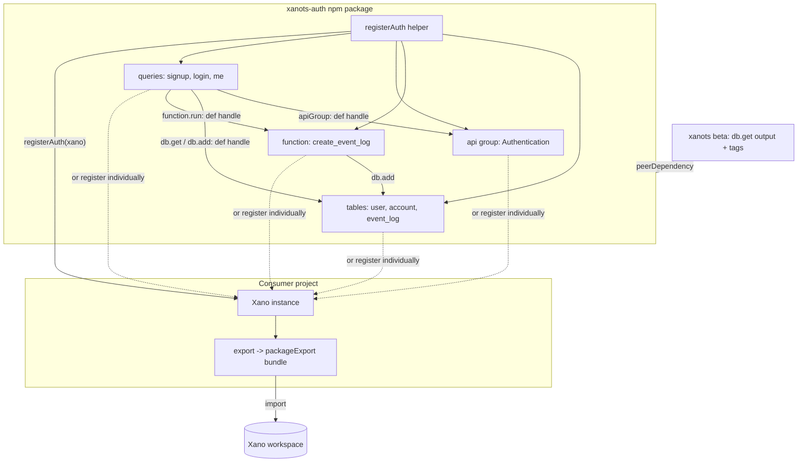

# feat: xanots-auth plug-and-play authentication package

**Target repos.** This plan spans two repositories. Paths prefixed `xanots:` are relative to the xanots SDK checkout (`~/git/xanots`); paths prefixed `quickstart:` are relative to the exported Xano quick-start XanoScript workspace (`~/xano/temp`); unprefixed paths are relative to this repo (`xanots-auth`), the plan's home.

## Summary

Create `xanots-auth`, the first xanots extension package: a versioned npm module that recreates Xano's quick-start Authentication API group (signup, login, me) plus its tables and event-log function as typed xanots defs, exported so any consumer project can register them into its own workspace. A small upstream xanots enhancement (`db.get` column output, `tags` on core kinds) lands first so the package contains no workarounds. Documentation is a first-class deliverable — this package doubles as the template for all future xanots extension packages.

## Problem Frame

xanots compiles typed TypeScript defs into Xano's importable workspace bundle, but every project so far authors its whole workspace in one place. There is no precedent for a reusable, versioned building block — and authentication is the piece every new project needs first. Recreating the Xano quick-start auth surface as an npm package proves the extension pattern end to end: cross-package object registration, stable guid identity, peer-dependency versioning, bundle-level testing, and the documentation conventions future extension packages will copy.

The behavior being ported is fixed by existing XanoScript sources (`quickstart:api/authentication/auth/`, `quickstart:table/`, `quickstart:function/getting_started_template/create_event_log.xs`). This is a faithful port, not an auth redesign.

---

## Requirements

**Port fidelity**

- R1. The package provides typed xanots defs for the Authentication API group and its three endpoints — `auth/signup` (POST), `auth/login` (POST), `auth/me` (GET) — matching the quick-start sources: stack order, precondition error types and byte-exact messages, token expiration 86400, and response shapes (`{authToken, user_id}` for signup/login; the bare user record for me).
- R2. The `user`, `account`, and `event_log` tables and the `Getting Started Template/create_event_log` function are ported with exact schema: field types, filters (`trim|lower` email, `min:8|minAlpha:1|minDigit:1` password), the `role` enum, the `password_reset` object field, and all indexes (unique btree on email, gin on xdo, btree created_at desc).
- R3. Source guids, the API group canonical (`QC35j52Y`), and `xano:quick-start` tags are preserved verbatim, so importing into a workspace that already has the quick-start template upserts the same objects idempotently instead of duplicating them.

**Composability**

- R4. Every def is individually importable and registerable on a consumer's `Xano` instance, and a one-call `registerAuth(xano)` helper registers the full set (group, queries, tables, function) in the right way.
- R5. All cross-object references use def handles (guid-resolved at authoring time), so they stay correct inside any consumer project. `user.account_id`, `event_log.user_id`, and `event_log.account_id` link to the real ported tables via `f.tableRef` — an intentional, documented deviation from the sources' dangling `table = ""` refs.
- R6. The package ships as ESM with type declarations, with `xanots` as a peer dependency (pinned to at least the beta that includes the U1 enhancements).

**Upstream capability (xanots repo)**

- R7. `db.get` supports typed column selection (`output`), emitting the engine's `output.customize/items` envelope — required by login (pulls the internal `password` hash) and me (limits returned columns).
- R8. `tags` is supported on query, table, API group, and function defs (it exists today only on addon/middleware/task/toolset), with test coverage, released as a consumable beta.

**Quality and documentation**

- R9. Tests assert on the compiled output at two levels: per-object encode assertions (guids, auth flags, statement names, filters, output lists, preconditions) and a full-bundle golden test deep-equal against a committed fixture.
- R10. The README documents the consumer path (install → register → export → import into Xano), the endpoint behavior contract including known quirks (indistinguishable login failures, null-body `me` for deleted users, the single-auth-table constraint), and each endpoint's inputs/outputs.
- R11. A standalone extension-authoring guide documents the pattern this package establishes — project structure, peer-dependency convention, guid pinning, def-handle references, bundle testing, publishing — so future extension packages can be built by copying it.

---

## Key Technical Decisions

- **Upstream-first gap closure** (user decision): the two expressiveness gaps (`db.get` output, `tags` on core kinds) are fixed in xanots itself and consumed via a beta release — not patched locally with statement-record escape hatches. The exemplar package must contain no workarounds; the escape-hatch route (`Object.assign` on the returned `Statement`) was rejected because its JSON shapes are unverified and it would teach future extension authors the wrong pattern.
- **Richer quick-start sources are canonical** (user decision): the port targets `quickstart:` sources (with `account_id`, `role`, event logging, `{authToken, user_id}` responses), not the trimmed copies in `xanots:xanoscript/`. Scope is the three core endpoints plus their transitive dependencies; the rest of the quick-start Authentication group (password reset, magic link, welcome email, demo agent) is deferred follow-up.
- **Pin source identities verbatim**: explicit `guid` on every def, canonical `QC35j52Y` on the group, source names kept as-is (including the `Getting Started Template/` function name prefix), and `xano:quick-start` tags carried through. Explicit guids bypass xanots' lock/derivation entirely — consumers get stable identities with no lockfile, and workspaces that already contain the quick-start template are upgraded in place rather than forked. Consequence: references to these defs must always pass the def handle, never a bare name (`xanots:src/refs/guid.ts` resolveRef prefers `target.guid`).
- **Real table refs replace dangling ones**: the sources declare `account_id`/`user_id` int columns with `table = ""`. Since all three tables ship together, the port uses `f.tableRef` to the actual defs. Documented as the one intentional schema deviation.
- **Bare-truthy precondition authored as an explicit comparison**: `precondition ($pass_result)` has no xanots equivalent; it is authored as `expr(ref("pass_result"), "=", c.bool(true))` — semantically equivalent, not byte-identical. Noted in the golden fixture.
- **Export surface is both granular and turnkey**: named exports for every def (tree-shakeable, consumer can cherry-pick or extend) plus `registerAuth(xano)` for the plug-and-play path. v1 offers no configuration options (token expiration, extra columns); consumers needing variation compose their own defs alongside ours. Configurability is deferred until a real consumer demands it.
- **Public npm, unscoped name `xanots-auth`** (assumption, matching how `xanots` itself is published): MIT license, beta-tagged prerelease flow copied from `xanots:package.json`. Flip to a scoped/private name before U2 if wrong.
- **Package layout mirrors the xanots readme's prescribed consumer structure** (defs in per-kind modules, explicit registration, no auto-discovery), since the readme's `examples/` directories do not actually exist — the test fixture workspace (`xanots:test/fixtures/workspace/index.ts`) is the only real precedent and this package becomes the canonical example.

---

## High-Level Technical Design

Directional guidance, not implementation specification.

**Component and data flow** — how a package-defined object ends up in a consumer's Xano instance:



Key property: every arrow inside the package is resolved to a guid at authoring time (def handles + explicit guids), so nothing depends on the consumer's naming or lockfile. The consumer's `export()` does statement encoding, which is why the xanots version (peer dependency) must include the U1 statement changes.

**Port mapping** — each XanoScript construct and its xanots authoring surface:

| XanoScript source construct | xanots surface | Status |
|---|---|---|
| `query ... verb=POST { api_group, auth, input, stack, response }` | `query({...})` — `xanots:src/kinds/query.ts` | exists |
| `db.get ... output=[...]` | `s.db.get` + new `output` arg | **U1 adds `output`** |
| `db.add user { data = {...} }` | `s.db.add` (`data`/`row`) | exists |
| `precondition ($x == null) { error_type, error }` | `s.precondition` + `expr(ref, "=", c.null())` | exists |
| `precondition ($pass_result)` (bare truthy) | `expr(ref, "=", c.bool(true))` | equivalent form |
| `security.check_password` / `security.create_auth_token` | `s.security.check_password` / `createAuthToken` | exists |
| `function.run "Getting Started Template/create_event_log"` | `functionRun({ fn: defHandle, input })` | exists (golden-verified) |
| `table { auth, schema, index }` incl. enum / object / tableRef fields, gin index | `table({...})`, `f.enum`, `f.object`, `f.tableRef` | exists |
| `api_group { canonical, guid }` | `apiGroup({...})` | exists |
| `tags = ["xano:quick-start"]` on query/table/group/function | `tags` def field | **U1 adds** |
| `guid = "..."` on every object | explicit `guid` def field | exists |
| `auth = "user"` on me | `auth: true` (resolves to the single registered auth table) | exists, constraint documented |

## Output Structure

Expected shape of the new package (scope declaration; per-unit Files lists are authoritative):

```
xanots-auth/
├── package.json / tsconfig.json / tsup.config.ts / vitest.config.ts / eslint.config.js
├── README.md
├── docs/
│   ├── extending-xanots.md        # the extension-pattern template guide (R11)
│   └── plans/
├── src/
│   ├── index.ts                   # named exports + registerAuth
│   ├── register.ts
│   ├── tables/{user,account,event-log}.ts
│   ├── functions/create-event-log.ts
│   └── api/{authentication-group,signup,login,me}.ts
└── test/
    ├── tables.test.ts / queries.test.ts / register.test.ts
    ├── bundle.test.ts
    └── fixtures/golden-bundle.json
```

---

## Implementation Units

### Phase A — upstream capability (xanots repo)

### U1. xanots: `db.get` output selection and `tags` on core kinds

- **Goal:** xanots can express everything the auth port needs; released as a beta this package can depend on.
- **Requirements:** R7, R8
- **Dependencies:** none
- **Files (xanots repo):** `xanots:src/statements/special/db.ts` (dbGet `output` arg), `xanots:src/kinds/query.ts`, `xanots:src/kinds/table.ts`, `xanots:src/kinds/api-group.ts`, `xanots:src/function/define.ts` + `xanots:src/function/compile.ts` (tags via the existing `encodeTags` in `xanots:src/kinds/common.ts`), tests in `xanots:test/kinds/` and the statements test directory alongside existing db statement tests.
- **Approach:** `output?: ColsOf<T>[]` on `DbGetArgs`, mirroring how `dbQuery` (`mvp:dbo_view`) already models output, emitting `output: { customize: true, filters: [], items: [...] }` instead of the hard-coded `customize: false`. The exact `items[]` entry shape must be byte-verified against a real engine export before the emit shape is frozen — the repo has no `dbo_getby`-with-output fixture. `tags?: string[]` is a def-field + `encodeTags` wire-up on the four kinds that currently hard-code `tag: []`. Finish with the repo's beta release flow (`release:beta` script).
- **Patterns to follow:** `dbQuery`'s output handling in `xanots:src/statements/special/db.ts`; tags plumbing in `xanots:src/kinds/addon.ts`; encode-level test style in `xanots:test/kinds/query.test.ts`.
- **Test scenarios:**
  - `db.get` without `output` emits `customize: false` with empty items (unchanged baseline — regression guard).
  - `db.get` with `output: ["id", "email", "password"]` emits `customize: true` and exactly those items in order, in the engine's verified entry shape.
  - Typed column names: an `output` entry not in the table's schema is a type error (compile-time; assert via a type-level test or `@ts-expect-error`).
  - `tags: ["xano:quick-start"]` on query, table, apiGroup, and function each emit `tag: [{tag: "xano:quick-start"}]`; omitted tags still emit `tag: []`.
  - Full-bundle test: a query using `output` + tags round-trips through `Xano.export()` without validation errors.
- **Verification:** new beta version published (or at minimum version-bumped and `npm pack`-able locally); the byte-verification note for `items[]` resolved against an engine export diff.

### Phase B — the package

### U2. Package scaffolding

- **Goal:** a buildable, testable, publishable empty package matching xanots conventions.
- **Requirements:** R6
- **Dependencies:** U1 (peer version to pin)
- **Files:** `package.json`, `tsconfig.json`, `tsup.config.ts`, `vitest.config.ts`, `eslint.config.js`, `.gitignore`, `LICENSE`, git init.
- **Approach:** copy xanots' configs minus the CLI entry (lib-only: esm + dts + sourcemaps, es2022, strict tsconfig with `verbatimModuleSyntax`). `xanots` as both `peerDependency` (range including the U1 beta) and `devDependency` (for tests). `files: ["dist", "README.md"]`, `prepublishOnly` build, beta release script. Public npm, name `xanots-auth`, MIT.
- **Patterns to follow:** `xanots:package.json`, `xanots:tsup.config.ts`, `xanots:tsconfig.json`, `xanots:vitest.config.ts`.
- **Test scenarios:** Test expectation: none — pure scaffolding; U6 exercises the toolchain end to end.
- **Verification:** `npm run build` emits `dist/index.js` + `dist/index.d.ts`; `npm run typecheck` and `npm run lint` pass on an empty `src/index.ts`.

### U3. Port tables and the event-log function

- **Goal:** `user`, `account`, `event_log` tables and `create_event_log` function as typed defs, identity-pinned to the sources.
- **Requirements:** R2, R3, R5
- **Dependencies:** U2 (and U1 for `tags`)
- **Files:** `src/tables/user.ts`, `src/tables/account.ts`, `src/tables/event-log.ts`, `src/functions/create-event-log.ts`; tests in `test/tables.test.ts`.
- **Approach:** named `FieldMap` schemas (gives typed column names to the U4 statements). Do not declare `id`/`created_at` — xanots auto-injects byte-identical system columns, and `primary(id)` + `btree(created_at desc)` indexes auto-prepend; declare only the unique email btree and the gin xdo indexes. `f.password` defaults to internal access (matches source). `f.tableRef` for the three relation columns pointing at the sibling defs (the documented deviation). `f.enum(["admin", "member"])` for role; `f.object` with nested children for `password_reset`. Explicit `guid` + `tags` on every def. The function keeps its source name verbatim, takes the four inputs (`user_id`, `account_id`, `action`, `metadata?`), does one `db.add` into `event_log` with `created_at: "now"`, responds null.
- **Patterns to follow:** table fixture style in `xanots:test/fixtures/workspace/`; field catalog JSDoc in `xanots:src/fields/catalog.ts` (tableRef and object usage); llms.txt Gotchas (system columns, tableRef-not-ref).
- **Test scenarios (encode-level, against each def's encoded XDO):**
  - `user`: `auth: true`; source guid verbatim; email column carries `trim` + `lower` methods and the password column `min:8`, `minAlpha:1`, `minDigit:1`; password access is `internal`; nullability matches source (`email`, `password`, `account_id`, `role`, `password_reset` nullable; `name` not); `role` enum values exactly `["admin", "member"]`; `password_reset` children are `token` (password type), `expiration` (nullable timestamp), `used` (bool); index set is primary(id) + btree(created_at desc) + `btree|unique` email asc.
  - `account` and `event_log`: source guids; `auth: false`; gin index on xdo with `jsonb_path_op`; event_log's `metadata` is json; relation columns resolve to the sibling tables' pinned guids (asserts the deviation actually links).
  - `create_event_log`: source guid; name exactly `Getting Started Template/create_event_log`; response null; its `db.add` targets event_log's guid; `metadata` input optional, the other three required.
  - All four defs emit `tag: [{tag: "xano:quick-start"}]`.
- **Verification:** encode tests green; guids in output match the `quickstart:` sources byte-for-byte.

### U4. Port the API group and the three endpoints

- **Goal:** `Authentication` group and signup/login/me queries, behaviorally faithful to the sources.
- **Requirements:** R1, R3, R5
- **Dependencies:** U3 (def handles), U1 (`db.get` output)
- **Files:** `src/api/authentication-group.ts`, `src/api/signup.ts`, `src/api/login.ts`, `src/api/me.ts`; tests in `test/queries.test.ts`.
- **Approach:** group with canonical `QC35j52Y` + source guid. Queries reference the group, tables, and function by def handle only (explicit guids make bare names unresolvable). Signup: db.get by email → precondition user == null (`accessdenied`, "This account is already in use.") → db.add with `created_at: "now"` and `role: "member"` → create_auth_token (expiration 86400, extras {}) → function.run create_event_log (`account_id: 0`, action "signup", metadata $user) → response `{authToken, user_id}`. Login: db.get by email with `output` covering id/created_at/name/email/password/account_id/role → two `accessdenied` "Invalid Credentials." preconditions (null user; failed `check_password`) → token → event log (action "login") → `{authToken, user_id}`. Me: `auth: true`, empty input, db.get by `auth("id")` with output excluding password → event log (action "get_auth_user") → bare `$user` response. Preserve stack order exactly — it determines observable error precedence (duplicate-email fires before password validation).
- **Patterns to follow:** query + api_group binding test in `xanots:test/kinds/query.test.ts`; value builders (`ref`, `inp`, `auth`, `c`) in `xanots:src/values/value.ts`; `expr` comparisons in `xanots:src/statements/conditional.ts`.
- **Test scenarios (encode-level):**
  - Group: canonical `QC35j52Y`, source guid, queries' `app.id` equals the group guid.
  - All three queries: source guids verbatim; verbs and paths (`auth/signup` POST, `auth/login` POST, `auth/me` GET); tags emitted.
  - Signup: inputs are name/email/password, all optional, email input carries trim+lower; stack statement order exactly db.get → precondition → db.add → create_auth → function.run; precondition is `accessdenied` with byte-exact message including trailing period; db.add data includes `role: "member"` and `created_at: "now"`; token expiration 86400 and extras `{}`; function.run targets create_event_log's guid with `account_id: 0`; response map has exactly `authToken` and `user_id` keys.
  - Login: db.get output items exactly the seven source columns including `password` (the single highest-value assertion — internal visibility would otherwise break check_password); both preconditions `accessdenied` "Invalid Credentials." (indistinguishable); check_password arg mapping (`text_password` from input, `hash_password` from the fetched user); event-log action "login".
  - Me: `auth` truthy; empty input; db.get output items exactly id/created_at/name/email/account_id/role — asserts `password` absent; response is the bare user value, not an object wrapper; **no** null-user precondition exists (locks in the 1:1 port: deleted-user tokens yield a null 200, and a helpful "fix" must not sneak in).
- **Verification:** encode tests green; a full `Xano` registration + `export()` of everything produces a bundle with no thrown validation errors.

### U5. Export surface and registerAuth helper

- **Goal:** the package's public API: granular named exports plus the one-call install path.
- **Requirements:** R4
- **Dependencies:** U3, U4
- **Files:** `src/index.ts`, `src/register.ts`; tests in `test/register.test.ts`.
- **Approach:** `index.ts` re-exports every def under stable names (`userTable`, `accountTable`, `eventLogTable`, `createEventLogFn`, `authenticationGroup`, `signupQuery`, `loginQuery`, `meQuery`) plus `registerAuth(xano)` which calls the consumer instance's `registerTables` / `registerFunctions` / `registerApiGroups` / `registerQueries` with the full set and returns the instance for chaining. No config parameters in v1 (KTD). Document inline (TSDoc) that the consumer must not register a second auth table — `auth: true` resolution throws on multiple auth tables at export.
- **Patterns to follow:** chainable register API on `xanots:src/workspace/xano.ts`; readme "Project structure" registration conventions.
- **Test scenarios:**
  - `registerAuth(new Xano().registerWorkspace(...))` followed by `export()` succeeds and the bundle payload contains 3 dbo entries, 1 function, 1 app, 3 queries.
  - `auth/me`'s encoded auth binding resolves to the user table's guid through the consumer instance (covers the untested-upstream `auth: true` resolution path from this side).
  - Registering defs individually (only what login needs, on a fresh instance) also exports cleanly — proves granular use.
  - A consumer instance that registers a second `auth: true` table throws at export (documents the constraint as a pinned behavior, not a surprise).
- **Verification:** register tests green; `import { registerAuth } from "xanots-auth"` works from the built `dist` (test against build output or a pack smoke).

### U6. Bundle golden test

- **Goal:** the byte-stability contract for a versioned package: the full exported bundle is deep-equal to a committed fixture.
- **Requirements:** R9
- **Dependencies:** U5
- **Files:** `test/bundle.test.ts`, `test/fixtures/golden-bundle.json`.
- **Approach:** one test builds the full workspace via `registerAuth`, exports, normalizes (mirror `xanots:test/helpers/normalize.ts` — strip signature/volatile fields), and deep-equals the committed fixture. The fixture is generated once, human-reviewed against the `quickstart:` sources (guids, messages, stack order), then frozen; regenerating it is an explicit, reviewed act. This is the tripwire that catches upstream xanots encoding drift when the peer dependency is bumped.
- **Patterns to follow:** golden-fixture harness in `xanots:test/conformance/harness.ts`; explicit vendored fixtures over snapshots (repo convention).
- **Test scenarios:**
  - Exported bundle deep-equals `test/fixtures/golden-bundle.json` after normalization.
  - Bundle-level cross-checks that survive fixture regeneration: every guid referenced by a statement (db targets, function.run target, app binding, auth binding) exists as a payload object's guid — no dangling references.
- **Verification:** green test; fixture diff reviewed once against sources at creation.

### Phase C — documentation

### U7. README and the extension-pattern guide

- **Goal:** the two documents that make this package usable and copyable: the consumer README and the extension-authoring template guide.
- **Requirements:** R10, R11
- **Dependencies:** U5 (API final), U6 (behavior pinned)
- **Files:** `README.md`, `docs/extending-xanots.md`.
- **Approach:** README covers: install (`npm install xanots-auth xanots@beta`), 10-line quickstart (workspace → `registerAuth` → `xanots export` → import into Xano), per-endpoint reference (inputs, responses, error contract with exact messages), the ported table schemas, and a "Behavior notes" section carrying the quirks a consumer must know: login failures are deliberately indistinguishable; signup's duplicate-email check fires before password validation; deleted-user tokens make `me` return null with 200; tokens live 24h with no refresh/revocation; email uniqueness is effectively case-insensitive (trim+lower at both input and column level); the consumer must have exactly one auth table; importing into a workspace that already has the quick-start template upgrades those objects in place (guid pinning). `docs/extending-xanots.md` is written for the next extension author: the def-module + explicit-registration structure, peerDependency convention and why, guid pinning vs derived guids and when each is right, def-handle references, the encode/golden two-level test strategy, tags, and the beta publish flow. It explicitly names this repo as the reference implementation.
- **Patterns to follow:** xanots readme's structure and register-then-export framing; the runtime edge-case catalog from planning research feeds the Behavior notes section.
- **Test scenarios:** Test expectation: none — documentation; the README quickstart snippet should be manually executed once against the built package as part of verification.
- **Verification:** README quickstart runs as written (copy-paste into a scratch consumer project, export succeeds); guide reviewed for completeness against what U1-U6 actually did.

---

## Scope Boundaries

**In scope:** the three core auth endpoints, their three tables, the event-log function, the API group, the upstream xanots enhancements they require, the export/install surface, compile-level tests, and the two documents.

### Deferred to Follow-Up Work

- The rest of the quick-start Authentication group: `reset/request_reset_link`, `reset/magic_link_login`, `reset/update_password`, `message/send_welcome_email`, `demo_agent/conversation` (plus their dependencies: `generate_magic_link`, email/agent infrastructure). Natural v2 of this package; the `password_reset` table field already ships, so v2 is additive.
- The `members_accounts` API group and `role_based_access_control` function (account/team management — a sibling package candidate, not auth core).
- Upstream `auth: <tableRef>` support in xanots so multi-auth-table consumers can use `auth/me`; v1 documents the single-auth-table constraint instead.
- An optional live runtime test suite against a deployed workspace (duplicate signup, wrong password, expired/deleted-user tokens, null-email double-signup quirk) — the compile-level suite pins the contract; runtime scenarios are documented in the README instead.
- Configurable token expiration / extra user columns — deferred until a real consumer needs it.
- An `llms.txt`-style machine-readable surface doc for the package (mirroring xanots' pattern).

**Outside this package's identity:** changing ported behavior — fixing the signup email-enumeration vector, adding a null-user guard to `me`, hardening the check-then-add signup race. The port is 1:1; behavior changes belong upstream in Xano's template, not in the recreation.

---

## Risks & Dependencies

- **Unverified engine shape for `db.get` output items** — the one real unknown. U1 requires byte-verification against an engine export before freezing the emit shape. Mitigation: the golden-bundle fixture review plus, ideally, one manual import of the exported bundle into a real Xano workspace as U6 acceptance.
- **Upstream `@TODO(byte-verify)` flags** on `create_auth` and db row expansion in xanots: reachable but not golden-verified. The one manual live-import smoke test above covers all of them at once.
- **Guid pinning clobbers modified templates**: a consumer who imported the quick-start and hand-edited those objects will have them overwritten on import. This is the intended upgrade semantic, but it must be prominent in the README (R10).
- **Canonical uniqueness per instance**: two workspaces on one instance importing canonical `QC35j52Y` — the engine self-heals the second with a new URL token; endpoint paths still work. Doc note only.
- **Peer-version coupling**: the package hard-requires the U1 beta; the golden-bundle test is the tripwire for encoding drift on later xanots upgrades. Keep the peer range tight (`>=` the U1 beta, `<` next major) until xanots stabilizes.
- **`auth: true` resolution is untested upstream**: U5's register tests exercise it from the consumer side; if a defect surfaces, the fix belongs in U1's repo scope.

---

## Sources & Research

- Port sources (canonical): `quickstart:api/authentication/authentication.xs`, `quickstart:api/authentication/auth/{signup_POST,login_POST,me_GET}.xs`, `quickstart:table/{user,account,event_log}.xs`, `quickstart:function/getting_started_template/create_event_log.xs`. The trimmed variants in `xanots:xanoscript/` are explicitly not the source of truth (user decision).
- xanots authoring surface: `xanots:src/kinds/{query,table,api-group}.ts`, `xanots:src/statements/special/db.ts` (dbGet/dbAdd; dbQuery's output model to mirror), `xanots:src/statements/special/calls.ts` (functionRun — golden-verified), `xanots:src/statements/special/misc.ts` (createAuthToken), `xanots:src/fields/catalog.ts` (enum/object/json/tableRef, password defaults to internal access), `xanots:src/refs/guid.ts` (explicit-guid precedence; def-handle rule), `xanots:src/workspace/xano.ts` (register/encode/export; `auth: true` resolution and its single-auth-table throw).
- Conventions and gotchas: `xanots:readme.md` (project structure, canonical uniqueness, lock interplay), `xanots:llms.txt` Gotchas; the readme's `examples/` links are stale — the directories do not exist; `xanots:test/fixtures/workspace/` is the real precedent.
- Test patterns: `xanots:test/kinds/query.test.ts` (encode + bundle-level), `xanots:test/conformance/harness.ts` + `xanots:test/helpers/normalize.ts` (golden fixtures).
- Prior xanots plans for context: `xanots:docs/plans/2026-06-24-002-feat-xanots-full-workspace-sdk-plan.md`, `xanots:docs/plans/2026-07-16-001-feat-xano-lock-identity-lockfile-plan.md` (lock vs explicit-guid precedence).
